# Playtorium Assignment

## Implementations

1. PTRA Server - The NestJS server provides the API for getting the final total price given a list of products and campaigns.
2. PTRA Mobile - The Mobile Application built by Flutter simulating the Shopping Cart for selecting the products with discount  and see the total price

## PTRA Server

### Getting Started

1. Build docker file

```bash
cd ptra-server
docker build -t cheeseandcupcake/ptra-server:prd .
```

2. Run the docker image on localhost with port `9000`

```bash
docker run -d -p 9000:9000 --name=ptra-server cheeseandcupcake/ptra-server:prd
```

3. Test the API

```bash
curl "http://localhost:9000/api/v1/product"
```

You should be able to see the list of product after using `curl`


### API Documents

**NOTE** more Product Id and Campaign Id information can be found at `database.service.ts`, on `MockDatabaseService` class

#### Get Total Price

Method: `POST`
Endpoint: `/api/v1/sale-campaign`

##### **Header**

`<None>`

##### **Query Parameters**

`<None>`

##### **Body**

|Name|Type|Required|
|----|----|----|
|products|List[Product Object]|✅|
|campaings|List[Campaign Object]||

**Product Object**

|Name|Type|Required|
|----|----|----|
|id|Integer|✅|
|quantity|Integer|✅|

**Campaign Object**

|Name|Type|Required|Note|
|----|----|----|----|
|id|Integer|✅|
|discount|Double|✅|
|everyXPrice|Double||Available only SpecialCampaigns|
|productCategory|String : Enum - ('Clothing', 'Accessories', 'Electronics')||Available only PercentageDiscountByItemCategory|

**Example**

```json
{
  "products": [
    {
      "id": 1,
      "quantity": 2
    },
    {
      "id": 3,
      "quantity": 1
    },
  ],
  "campaings": [
    {
      "id": 1,
      "discount": 150
    }
  ]
}
```

**Response**

Case - 200 (Success)

|Name|Type|Required|
|----|----|----|
|totalPrice|double||

```json
{
  "totalPrice": 1250
}
```

Case - 200 (Missing Property)

The result will be null

```json
{
  "totalPrice": null
}
```

Case - 400 : Duplicated category on different campaign
Case - 400 : Invalid discount value 
  - Discount in decimal form should not be less than 0
  - Discount in percentage should be in between 0 and 100 inclusive

Case - 400 : Invalid Dto property 
   - `productCategory` should be available only PercentageDiscountByItemCategory, 
   - `everyXPrice` should be available only SpecialCampaign

|Name|Type|Required|
|----|----|----|
|message|String|✅|

```json
{
    "message": "Sale Campaign Dto is Invalid"
}
```

#### Get All Products List

Method: `GET`
Endpoint: `/api/v1/product`

##### **Header**

`<None>`

##### **Query Parameters**

`<None>`

##### **Body**

`<None>`

##### **Response**

Case - 200 (Success)

|Name|Type|Required|
|----|----|----|
|id|Integer|✅|
|name|String|✅|
|categoryId|Integer|✅|
|price|double|✅|
|imageURL|String|✅|

```json
[
    {
        "id": 1,
        "name": "T Shirt",
        "categoryId": 1,
        "price": 350,
        "imageURL": "https://mockups-design.com/wp-content/uploads/2021/08/Hanging_T-Shirt_Mockup_2.jpg"
    },
    {
        "id": 2,
        "name": "Hat",
        "categoryId": 2,
        "price": 250,
        "imageURL": "https://static3.depositphotos.com/1001449/153/i/450/depositphotos_1531740-stock-photo-hat.jpg"
    },
    {
        "id": 3,
        "name": "Hoodie",
        "categoryId": 1,
        "price": 700,
        "imageURL": "https://unblast.com/wp-content/uploads/2021/10/Simple-Hoodie-Mockup.jpg"
    },
    {
        "id": 4,
        "name": "Watch",
        "categoryId": 2,
        "price": 850,
        "imageURL": "https://images.pexels.com/photos/277390/pexels-photo-277390.jpeg?cs=srgb&dl=pexels-pixabay-277390.jpg&fm=jpg"
    },
    {
        "id": 5,
        "name": "Bag",
        "categoryId": 2,
        "price": 640,
        "imageURL": "https://images.pexels.com/photos/1152077/pexels-photo-1152077.jpeg"
    },
    {
        "id": 6,
        "name": "Belt",
        "categoryId": 2,
        "price": 230,
        "imageURL": "https://img.freepik.com/free-photo/leather-belt_74190-2615.jpg"
    }
]
```

## PTRA Mobile

The frontend part of this system written by **Flutter** with **Clean Architecture** pattern.

### Features

**Homepage**
- View all products list
- Add product to cart
- Select Campaign to apply on cart. 
  - Each Campaign has their own unique parameters as stated in requirements

**Cart**
- View products that are added to cart
- Add or remove product's quantity
- View campaings that are going to be applied on this cart
- Remove campaings on cart

**Checkout**
- See summary (total price) of current cart

**NOTE**: Most of the features are intereacting with server. Hence, docker should be run first before running Mobile Application.

#### Current Available Platform

|Platform|Availability|
|--------|------------|
|iOS|✅|
|Android|✅|
|Web||
|MacOS||
|Windows||
|Linux||

#### Getting Started

1. Use Flutter version `3.16.0` to run. (You may use Flutter Version Management or [FVM](https://fvm.app/) to apply this specific version)
2. Run the application (vscode)
   1. iOS - Run on DEV configuration

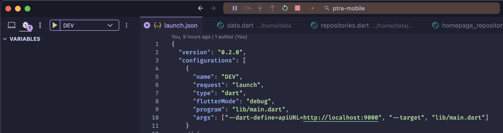

   2. Android 
      1. Change the apiURL to be ` "--dart-define=apiURL=http://10.0.2.2:9000",` since `localhost` does not work in Android
      2. Run on Dev Configuration

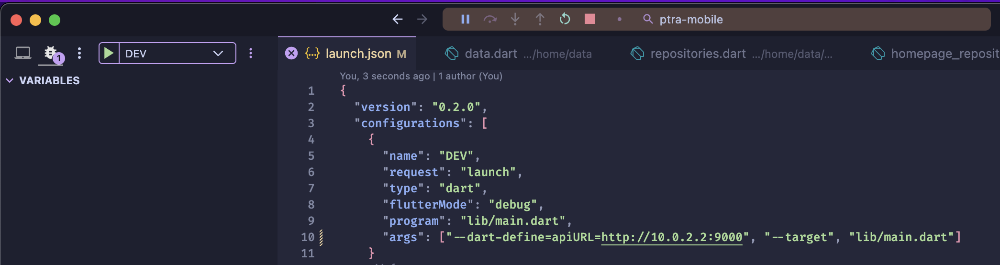

#### User Interface Demo

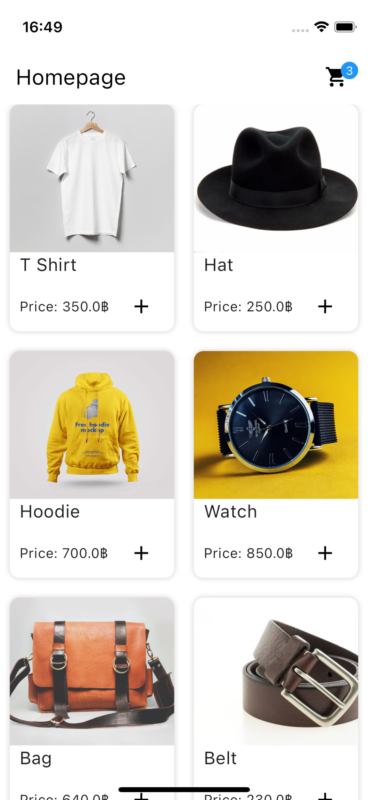

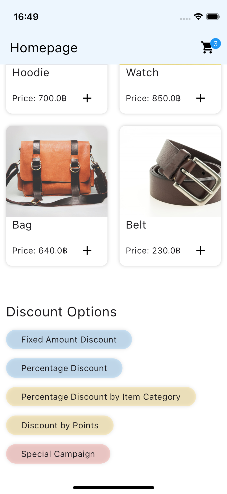

- Homepage (View All Products List)
- When scrolling down, there will be discount (campaign) options available

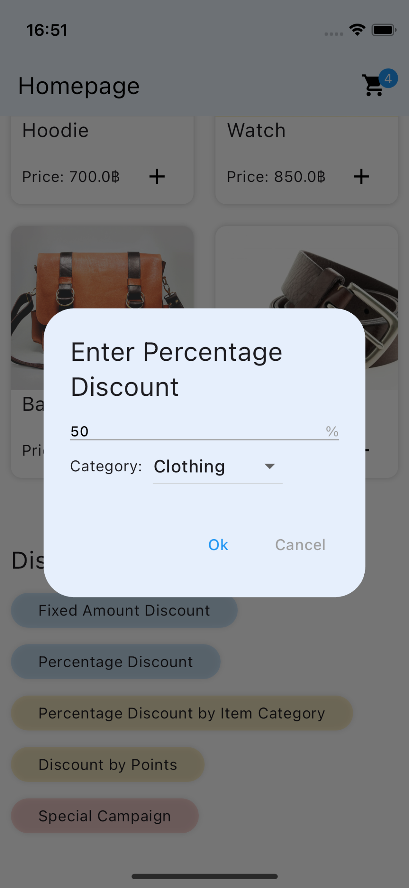

- Entering the discount amount on Campaigns

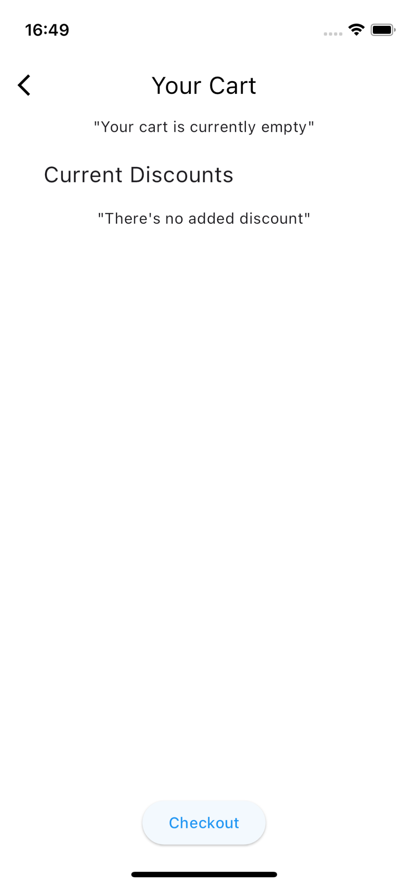

- Cart page with empty products and discounts

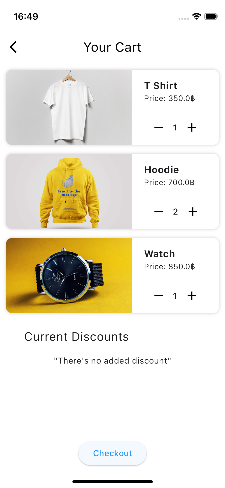

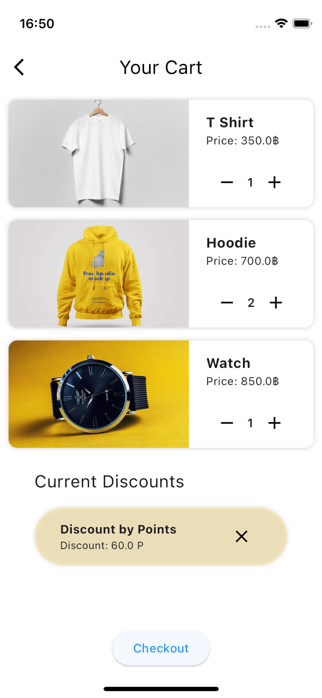

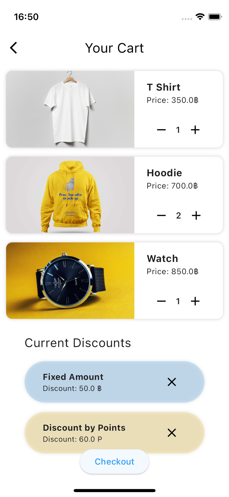

- Cart page with products and discounts

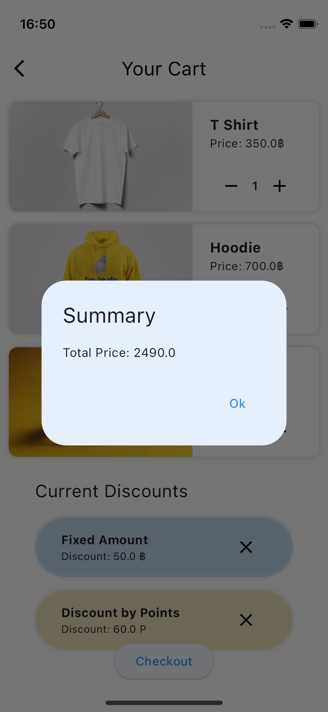

- Click `Checkout` button to see the total price of this cart

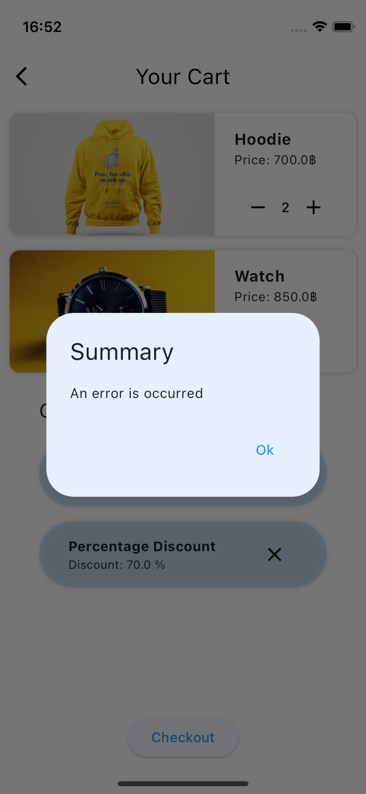

- If the campaings are invalid (duplicated campaign on similar type or other errors), the summary will show the error.